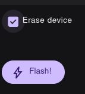
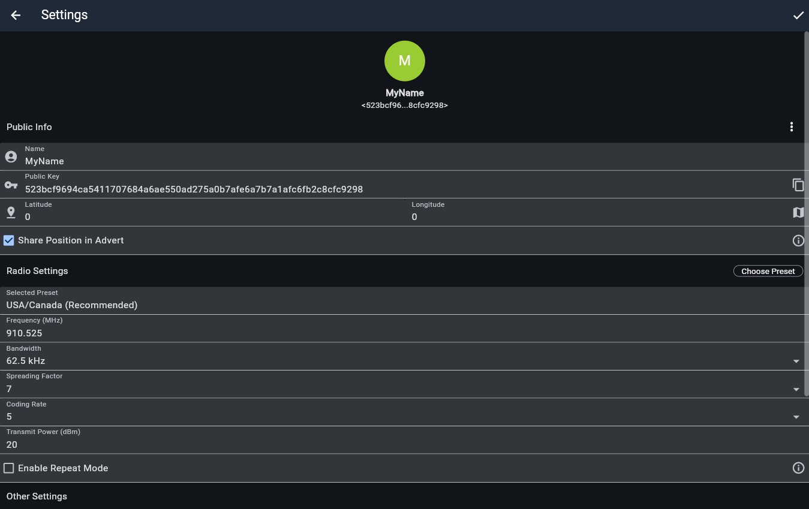
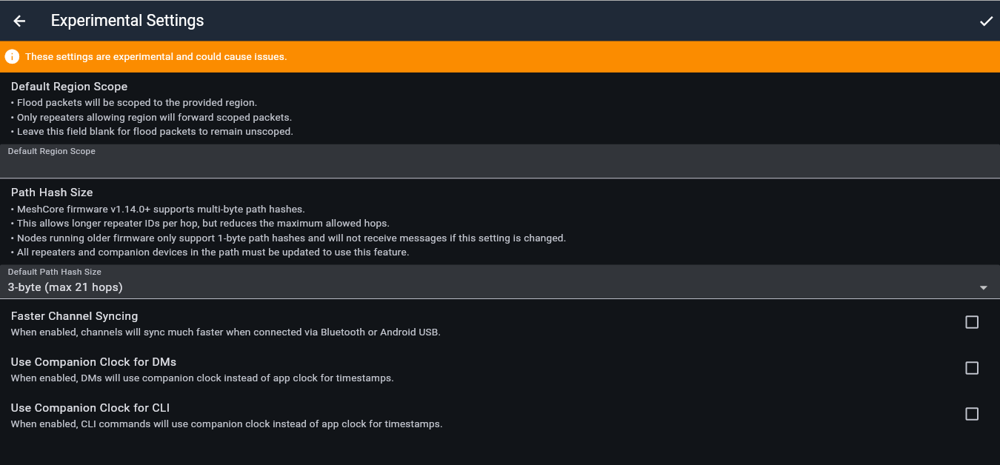

# MaineMesh Meshcore Companion nodes

Companion nodes alow you to connect to the mesh network to send and receive messages.  They come in a wide variety, including standalone nodes with built in keyboards and displays, and nodes that connect via Bluetooth to an app running on your phone or tablet.  You can find some recommended examples on the Meshcore website at https://meshcore.io


## Configuration
Details of flashing the Meshcore firmware to your device can be found on the Meshcore site at https://meshcore.io

There are some videos at the bottom of the page that cover the basics, along with more information in the Docs section.

Note that if you are converting from Meshtastic or some other firmware, you need to check the "Erase Device" option in the flasher first, then click the "Flash" button.



Once you have the firmware installed, run the Meshcore app on your phone, scan for Bluetooth connections and connect to the device.  If the device has a screen, the Bluetooth PIN will be displayed on it, otherwise the code is 123456 for devices without a screen.

Go into the Settings for the device.

In the Name field, enter a name that describes you, such as your first name or a nickname.  This is what appears to other people when they view their Contacts list.

Check "Share Position in Advert".

Radio Settings:  USA/Canada

Do NOT enable Repeat Mode.  

Select "Experimental Settings".  

Set "Default Path Hash Size" to 3-byte.

Click the check mark on the Experimental Settings page to save the settings.

Click the left arrow to go back to the main settings page.

Click the check mark on the main settings page to save the settings.

Scroll to the bottom and select "Reboot".





## MaineNet channel
We have a dedicated state wide channel called "MaineNet".  To add this to your companion, you can either scan the image from the phone app, or add it manually:

```
Name: MaineNet
Key: 6eb648d2c99f3a093b850610ec5bd2c3
```


