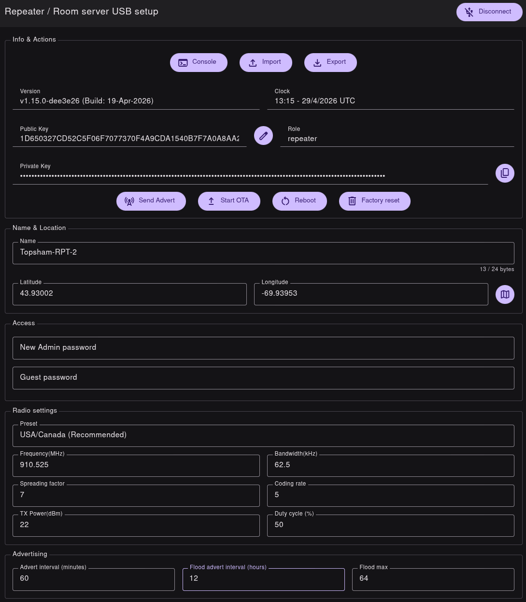
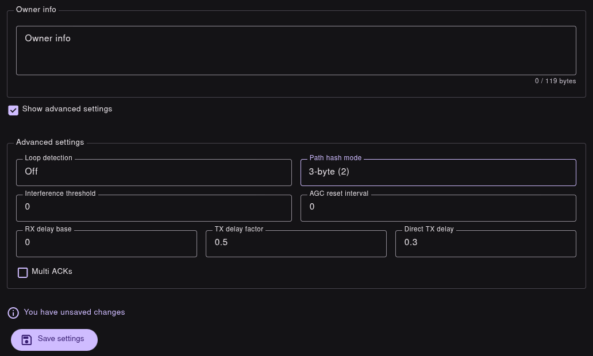

# MaineMesh Meshcore Repeaters

## Hardware

If you are looking for a prebuilt node, we have found the [Seeed Solar P1 Pro](https://www.seeedstudio.com/SenseCAP-Solar-Node-P1-Pro-for-Meshtastic-LoRa-p-6412.html) to be a decent unit.

We do recommend replacing the factory antenna with something better, such as the [Rokland 3 dBi N-Male Antenna](https://store.rokland.com/collections/all-helium-antennnas/products/3-dbi-rak-brand-fiberglass-outdoor-antenna-bracket-mount-for-rak-bobcat-sensecap) which can be mounted directly onto the Seeed P1 Pro, or the [Rokland 5.8 dBi N-Male Antenna](https://store.rokland.com/collections/all-helium-antennnas/products/5-8-dbi-n-male-omni-outdoor-915-mhz-antenna-large-profile-32-height-for-helium-rak-miner-2-nebra-indoor-bobcat) which needs to be mounted separately.

Either of those antennas would also need an RP-SMA to N-female coaxial cable to connect to the Seeed P1 Pro, such as the [Eagles 2PCS RPSMA Male to N Female Connector 12inch Coaxial Assembly](https://www.amazon.com/dp/B06XJM2PK5).

If you like to tinker and build things, we have also been experimenting with a DIY 1 watt repeater node based around the RAK Wireless WisMesh 1W Booster Starter Kit.  Please note this is still very much a Work In Progress, but you can find a [rough draft of the 1 watt build here](Repeater-Build-Guide.md).

## Configuration
Details of flashing the Meshcore firmware to your device can be found on the Meshcore site at https://meshcore.io

There are some videos at the bottom of the page that cover the basics, along with more information in the Docs section.

After you have flashed the Meshcore repeater firmware, go into  "Repeater Setup".

Name and Location: Fill in a name for your repeater.  Our naming scheme is Location-Role-Number, such as "Brunswick-RPT-1", "Brunswick-RPT-2", "Topsham-RPT-1", etc.

Fill in the Latitude and Longitude, or click on the Map icon to the right of those fields and choose your location.  Please note it is important to share the correct location of the repeater so we can better understand our coverage area.

Access: Choose an admin password for remote administration.

Radio Settings:  Use the preset "USA/Canada (Recommended)" setting.

Advertising:  During testing we are using an Advert interval of 60 minutes, and Flood advert interval of 3 hours.  Once we've developed the network we will be changing these back to the defaults of 0 and 12.

Owner info:  Fill in your name and email address.

Scroll to the bottom and click "Show advanced settings".

Change "Path hash mode" to "3-byte (2)".

Click the "Save Settings" button at the bottom. 

