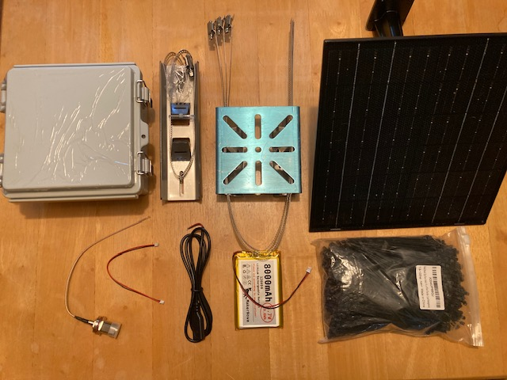
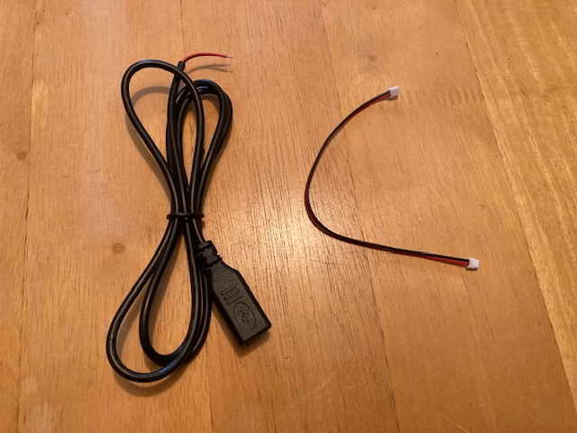
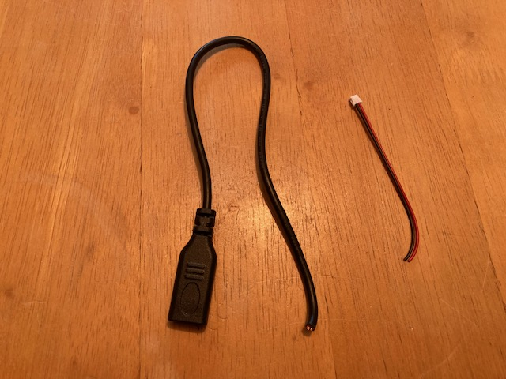
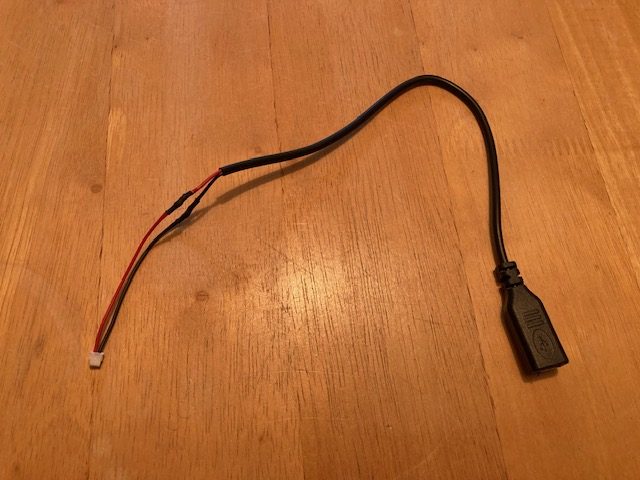
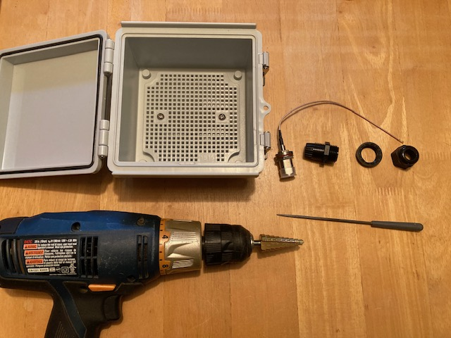
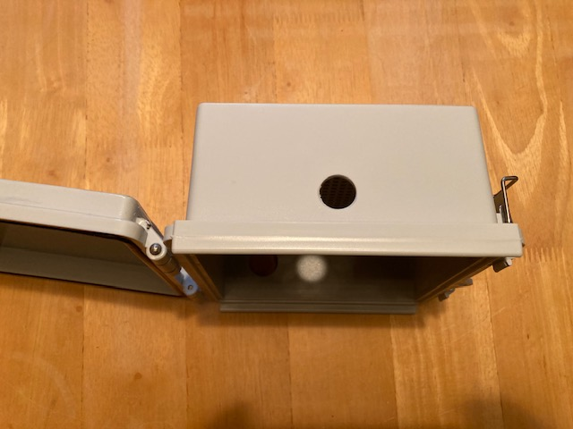
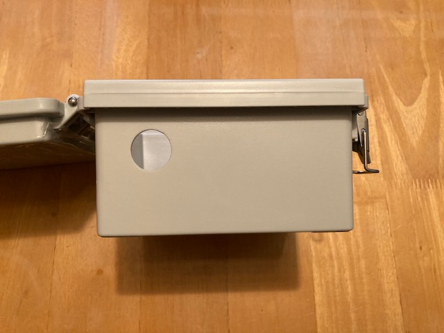
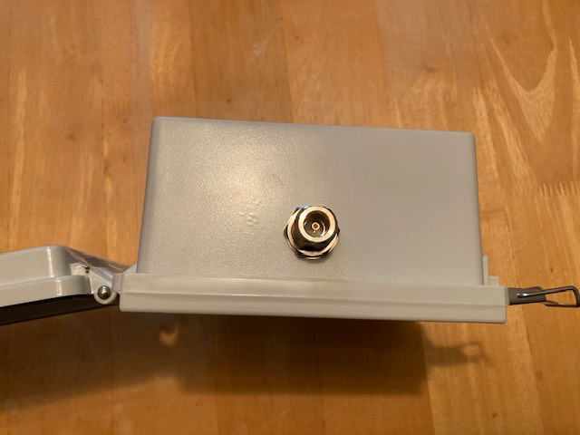
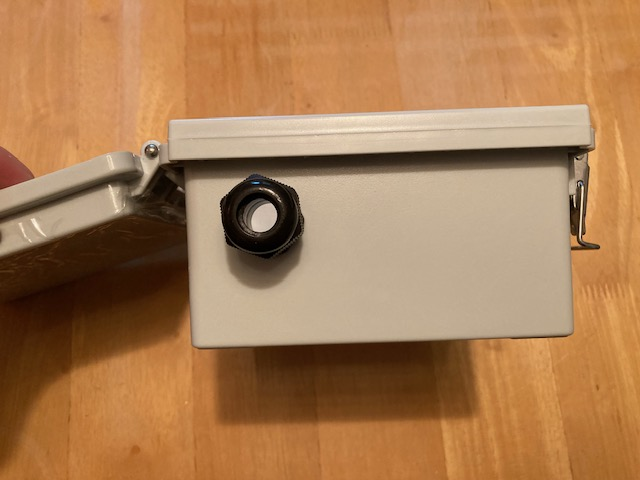
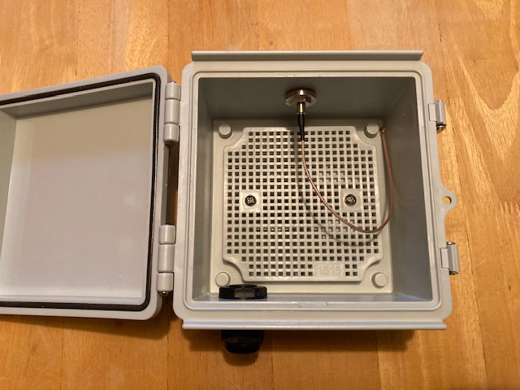

# This is a DRAFT document subject to change as we work out the details.

# Note that this has not yet been vetted, so please don't buy anything based on this page!

# 1 watt solar repeater build guide

# Parts for the 1 watt RAK MeshCore solar powered repeater.

**RAKWireless parts:**

Note when ordering from RAK Wireless, choose the DDP (Delivery Duty Paid) shipping option so you don't get a separate bill for tariffs + tariff collection fees.

RAK 3401 1 watt radio 915 Mhz:
https://store.rakwireless.com/products/meshtastic-1w-lora-booster-kit-rak3401?variant=45678368882886

RAK 12500 GPS:
https://store.rakwireless.com/products/wisblock-gnss-location-module-rak12500

**Amazon parts:**

Enclosure, Grey, 5.9" x 5.9" x 3.5":
https://www.amazon.com/gp/product/B0C2HJGRFS/?th=1

IPEX to N Female coax for Lora antenna, 8 inch (internal to enclosure):
https://www.amazon.com/dp/B0CRCZ2JG3?th=1

Eightwood N Female to N Male Jumper RG400 Low Loss Coax Cable 3 Feet (external to enclosure):
https://www.amazon.com/dp/B0B3XKJPR3?th=1

USB Type-C Pigtail Cable Extension Power Cable, type C female:
https://www.amazon.com/dp/B0BFHW7PXD?th=1

10 Watt Solar Panel, black:
https://www.amazon.com/dp/B0DHZH79J4?th=1

Mast mount for solar panel, Universal Wall Mounting Bracket:
https://www.amazon.com/dp/B0BVSXKMGM

Mast mount for enclosure, 6.9" x 1.9" Pole Mounting Kit :
https://www.amazon.com/dp/B0B4DW4HFM?th=1

Coax Seal - for sealing antenna connections from moisture:
https://www.amazon.com/Fittings-Universal-Waterproof-Non-Conducting-Wire/dp/B00UZWM1U0/

Small 4 inch zip ties for securing the RAK radio to the internal enclosure perfboard:
https://www.amazon.com/1000pcs-Zipties-Locking-Plastic-Management/dp/B0FSJQGKSG/?th=1

**Rokland parts:**

MakerFocus Flat 3.7V 8000 mAh Battery with JST Type PH 2.0 Plug:
https://store.rokland.com/products/makerfocus-flat-3-7v-3000mah-rechargeable-lithium-polymer-11-1wh-battery-with-jst-type-ph-2-0-plug?variant=43445176369235

5.8 dBi Outdoor Fiberglass Antenna:
https://store.rokland.com/products/rak-wireless-5-8-dbi-outdoor-black-fiberglass-helium-hotspot-antenna?variant=41928821473363

**Options to consider:**

Note that the legal maximum power allowed in the US is a 1 watt transmitter attached to a 5.8dBi antenna.
The 10 dBi antenna can help to increase the receive signal strength for listening to far away repeaters, however you will have to turn the TX power down to 18 to comply with legal restrictions.

10 dBi Rokland Backcountry Rural N-Male Antenna:
https://store.rokland.com/products/10-dbi-backcountry-n-male-omni-outdoor-helium-915-mhz-antenna-48-for-rak-miner-2-nebra-indoor-bobcat-hotspots?variant=39392616841299

12 inch coax cable if you are mounting the antenna very close above the enclosure - used in place of the 3 foot cable above:

https://www.amazon.com/dp/B0B3XJ4ZKR?ref=ppx_yo2ov_dt_b_fed_asin_title&th=1

If you want to run from PoE (Power over Ethernet), you can eliminate the solar panel and replace with an ethernet passthrough and PoE splitter:

https://www.amazon.com/dp/B07PH4GL2F?th=1

https://www.amazon.com/dp/B09GM8FB3X?th=1

For a more compact installation, you can eliminate the larger antenna and external coax cable above and replace with this small antenna that mounts directly onto the N connector on the enclosure itself.  Note that although this antenna says 5 dB, people testing it shows that it is closer to 2-3 dB:

ALFA Network AOA-915-5ACM Antenna:
https://www.amazon.com/dp/B08H8J6ZV6

# Build it

## Gather the parts

Gather the parts that you need to put the node together.

## Make the solar cable

I prefer solder and heat shrink, but you could use a crimp connector here if you wish.

Take the solar power cable that comes with the RAK and cut it in half.

Trim the USB-C pigtail down to a few inches.

Connect the red wire from the solar cable to the red wire on the USB-C pigtail, adn the black wire from the solar cable to the black wire on the USB-C pigtail.

## Drill the power and antenna holes

A step drill makes drilling the holes easy and clean.  I like to use a small round file to clean up the holes after drilling.

Drill out the top of the enclosure for the antenna bulkhead connector, and the bottom of the enclosure for the cable gland (use one of the cable glands included with the enclosure).

Suggested locations for the holes can be seen in the pictures below.  Leave enough space for the RAK radio to fit between the antenna coax and the perfboard.

Test fit the cable gland and the antenna bulkhead mount in the holes, then remove them and set them aside for now.

## Populate the perfboard

Connect a zip tie back on itself to make a spacer.  Make four of these.

Put the spacers between the RAK radio and the perboard under each mounting hole, and use small zip ties to attach the RAK radio to the top half of the perfboard.

Use zip ties to attach the battery to the bottom half of the perfboard.

DO NOT CONNECT THE BATTERY TO THE RAK RADIO.  You will damage the radio if you power it on without an antenna attached.

## Connections

Plug the solar cable into the RAK radio.  Make sure you have the oconnector and the red wire oriented correctly!

Bundle the solar cable up and use zip ties to secure it to the left side of the perfboard.  Leave the USB-C connector pointing towards the bottom about halfway up the perfboard.

The little IPEX connectors are somewhat fragile, so work carefully when connecting them.

Connect the Bluetooth antenna to the RAK radio.

Connect the GPS antenna to the RAK radio.

Connect the antenna coax cable to the RAK radio.

## Mount everything in the enclosure

Carefully lower the perfboard into the enclosure and secure it with the two screws.

Insert the antenna bulkhead mount through the top hole in the enclosure and secure it with the nut and lock washer.  Use one wrench to hold the bullkhead connector in place and a second wrench to tighten the nut.  You want it tight enough that it will not rotate in the hole when you attach an external antenna or coax cable.

Insert the cable gland in the bottom hole.  You want it fairly tight, but be careful not to overtighten and strip the plastic threads.

Peel the backing from the sticky tape on the GPS antenna, and stick it to the top of the enclosure.

Peel the backing from the sticky tape on the Bluetooth antenna, and stick it on the bottom of the enclosure.

Leave the battery disconnected for now.  You will damage the radio if you power it on without an antenna attached.

## Antenna

At this point you need an antenna connected before you can do much else.  

If you have one of the small ALFA 915 antennas, you can screw it onto the antenna connector on the top of the enclosure.

If you have the larger antennas, laying it out alongside the enclosure on a wooden or plastic table might make it easier due to the size.  There is a chance that a metal table might severely affect the SWR of the antenna if the antenna is paying on it, so you might want to avoid using a metal table.

Connect the antenna, then connect a USB-C cable from the USB-C port on the RAK radio to your computer.  Flash the firmware and configure the node following the recommendations on the [Repeater page](README.md).

Once done, disconnect the USB-C cable, and ensure there is no power going to the RAK radio (USB, Battery, and solar are NOT connected).

##  Mount it

If you are going to mount the repeater on a pole, attach the pole mounting kit to the back of the enclosure.

Attach the Universal Wall Mounting bracket to the solar panel.

Using hose clamps, mount the solar panel and the enclosure to the pole.

If you are using one of the larger antennas, mount the antenna to the top of the pole, and connect the coax cable to the antenna and the bulkhead connector on the top of the enclosure.

## Power it up

After double checking that the antenna is connected properly, you are now ready to power on the RAK radio.

Inside the enclosure, connect the battery to the RAK radio.

Slide the solar panel USB cable in through the cable gland on the bottom of the enclosure, and connect it to the USB-C pigtail that is mounted on the left side of the perfboard.

TO DO:  Figure out options to seal up the solar panel USB cable where it passes through the cable gland.  RTV?  Rubber grommet?

TO DO:  Add more pictures to fill in details above.
