# This is a DRAFT document subject to change as we work out the details.

# 1 watt solar repeater build guide

# Parts for the 1 watt RAK MeshCore solar powered repeater.

**RAKWireless parts:**

When ordering from RAK Wireless, choose the DDP (Delivery Duty Paid) shipping option so you don't get a separate bill for tariffs + tariff collection fees.

RAK 3401 1 watt radio 915 Mhz:
https://store.rakwireless.com/products/meshtastic-1w-lora-booster-kit-rak3401?variant=45678368882886

RAK 12500 GPS:
https://store.rakwireless.com/products/wisblock-gnss-location-module-rak12500

**Amazon parts:**

Enclosure, Grey, 5.9" x 5.9" x 3.5":
https://www.amazon.com/gp/product/B0C2HJGRFS/?th=1

IPEX to N Female coax for Lora antenna, 8 inch (internal to enclosure):
https://www.amazon.com/dp/B0CRCZ2JG3?th=1

Eightwood N Female to N Male Jumper RG400 Low Loss Coax Cable 3 Feet (external to enclosure):
https://www.amazon.com/dp/B0B3XKJPR3?th=1

USB Type-C Pigtail Cable Extension Power Cable, type C female:
https://www.amazon.com/dp/B0BFHW7PXD?th=1

10 Watt Solar Panel, black:
https://www.amazon.com/dp/B0DHZH79J4?th=1

Mast mount for solar panel, Universal Wall Mounting Bracket:
https://www.amazon.com/dp/B0BVSXKMGM

Mast mount for enclosure, 6.9" x 1.9" Pole Mounting Kit :
https://www.amazon.com/dp/B0B4DW4HFM?th=1

Coax Seal - for sealing antenna connections from moisture:
https://www.amazon.com/Fittings-Universal-Waterproof-Non-Conducting-Wire/dp/B00UZWM1U0/

Small 4 inch zip ties for securing the RAK radio to the internal enclosure perfboard:
https://www.amazon.com/1000pcs-Zipties-Locking-Plastic-Management/dp/B0FSJQGKSG/?th=1

**Rokland parts:**

MakerFocus Flat 3.7V 8000 mAh Battery with JST Type PH 2.0 Plug:
https://store.rokland.com/products/makerfocus-flat-3-7v-3000mah-rechargeable-lithium-polymer-11-1wh-battery-with-jst-type-ph-2-0-plug?variant=43445176369235

5.8 dBi Outdoor Fiberglass Antenna:
https://store.rokland.com/products/rak-wireless-5-8-dbi-outdoor-black-fiberglass-helium-hotspot-antenna?variant=41928821473363

**Miscellaneous parts:**

Three 1 inch long 1/4 inch bolts, three nuts, and six washers.
Black RTV

**Options to consider:**

The legal maximum power allowed in the US is a 1 watt transmitter attached to a 5.8dBi antenna.
The 10 dBi antenna can help to increase the receive signal strength for listening to far away repeaters, however you will have to turn the TX power down to 18 to comply with legal restrictions.

10 dBi Rokland Backcountry Rural N-Male Antenna:
https://store.rokland.com/products/10-dbi-backcountry-n-male-omni-outdoor-helium-915-mhz-antenna-48-for-rak-miner-2-nebra-indoor-bobcat-hotspots?variant=39392616841299

12 inch coax cable if you are mounting the antenna very close above the enclosure - used in place of the 3 foot cable above:

https://www.amazon.com/dp/B0B3XJ4ZKR?ref=ppx_yo2ov_dt_b_fed_asin_title&th=1

If you want to run from PoE (Power over Ethernet), you can eliminate the solar panel and replace with an ethernet passthrough and PoE splitter:

https://www.amazon.com/dp/B07PH4GL2F?th=1

https://www.amazon.com/dp/B09GM8FB3X?th=1

For a more compact installation, you can eliminate the larger antenna and external coax cable above and replace with this small antenna that mounts directly onto the N connector on the enclosure itself.  Note that although this antenna says 5 dB, people testing it shows that it is closer to 2-3 dB:

ALFA Network AOA-915-5ACM Antenna:
https://www.amazon.com/dp/B08H8J6ZV6

# Build it

## Gather the parts

Gather the parts that you need to put the repeater together.

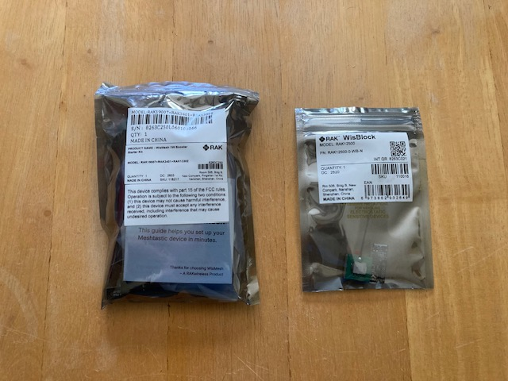
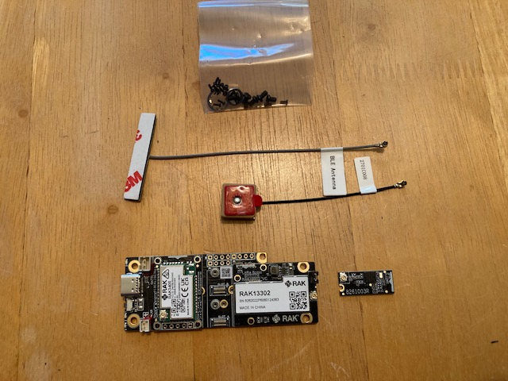

## Install the GPS

Install the 12500 GPS into slot A on the RAK radio.

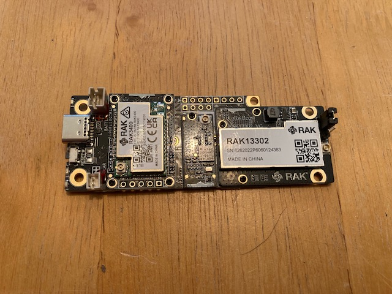

## Make the solar cable

I prefer solder and heat shrink, but you could use crimp connections here if you wish, as long as they are insulated.

Take the solar power cable that comes with the RAK and cut it in half.

Trim the USB-C pigtail down to a few inches.

Connect the red wire from the solar cable to the red wire on the USB-C pigtail, and the black wire from the solar cable to the black wire on the USB-C pigtail.

## Drill the solar panel and antenna holes

A step drill makes drilling the holes easy and clean.  I like to use a small round file to clean up the holes after drilling.

Drill out the top of the enclosure for the antenna bulkhead connector, and the bottom of the enclosure for the cable gland (use one of the cable glands included with the enclosure).

Suggested locations for the holes can be seen in the pictures below.  Leave enough space for the RAK radio to fit between the antenna coax and the perfboard.

Test fit the cable gland and the antenna bulkhead mount in the holes, then remove them and set them aside for now.

## Populate the perfboard

When using zip ties, trim the excess using [flush cutters](https://www.amazon.com/dp/B00FZPDG1K?th=1) so as to not leave a sharp edge.  Scissors or normal wire cutters can leave a very sharp edge on the zip tie that you will eventually cut yourself on.  

Connect a zip tie back on itself to make a spacer.  Make three of these.  

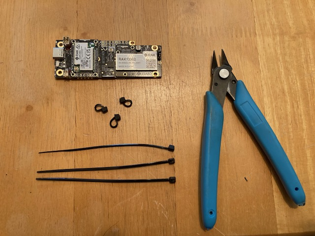

Put the spacers between the RAK radio and the perfboard under each mounting hole, and use three zip ties to attach the RAK radio to the top half of the perfboard, using the three mounting holes as shown in the picture.

Be careful of the small LEDs mounted on the end of the board (to the right in the pictures)!  Place the zip ties going towards the top and bottom respectively instead of going over the top of the LEDs.

Tighten the zip ties enough to hold the board firmly in place, but don't get too agressive here.  

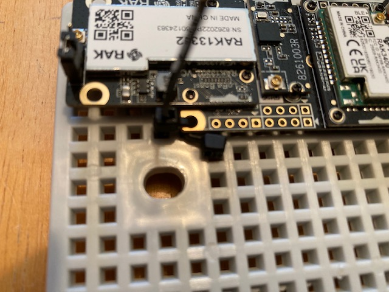
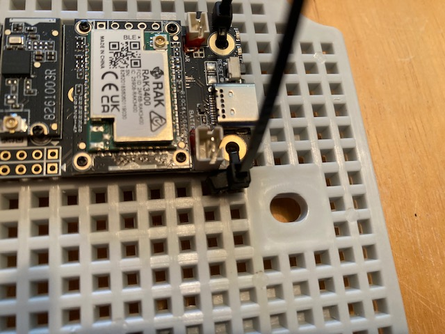
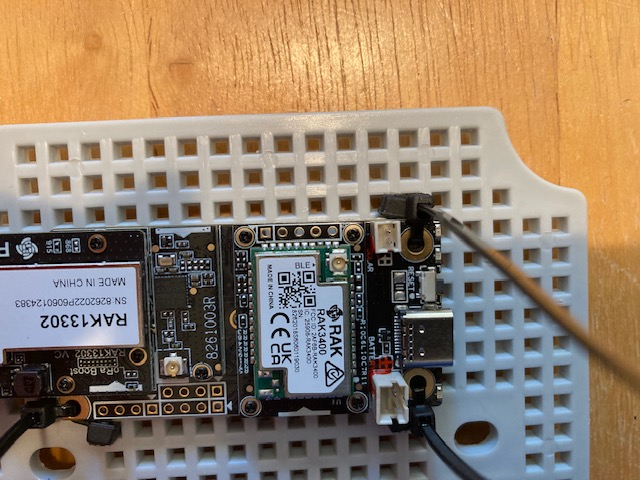
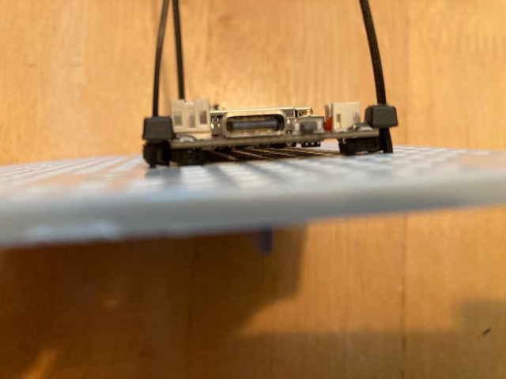
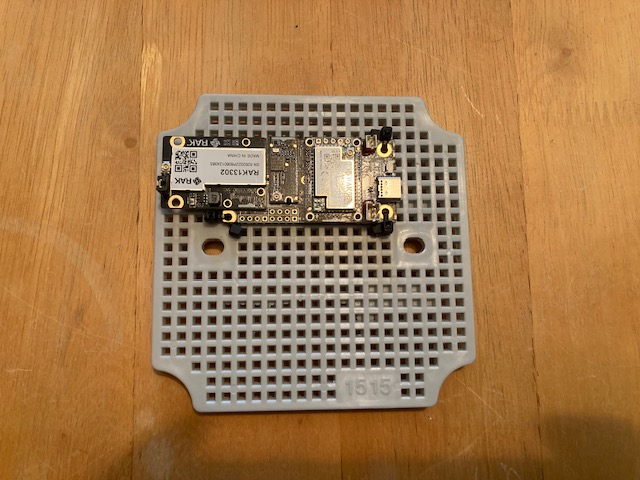

Use zip ties to attach the battery to the bottom half of the perfboard.  You may have to daisy chain three zip ties together to have enough to reach all the way around the battery.

Secure the battery at the top, middle and bottom.  Tighten enough so the battery is held firmly in place, but don't get too aggressive.

**DO NOT CONNECT THE BATTERY TO THE RAK RADIO.  You will damage the radio if you power it on without an antenna attached.**

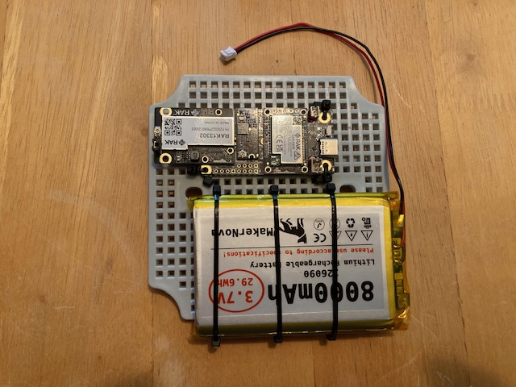
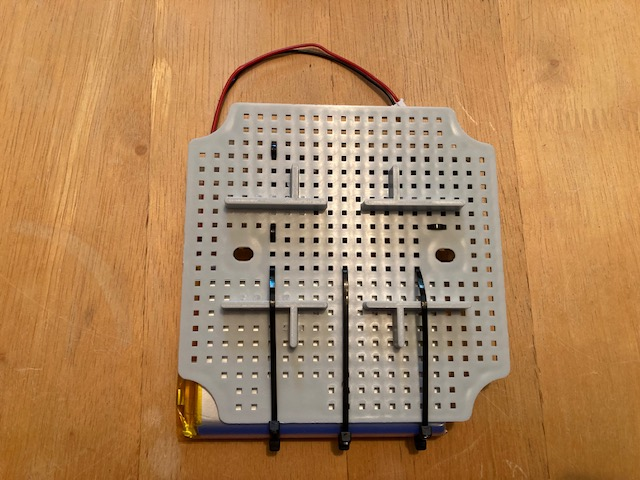
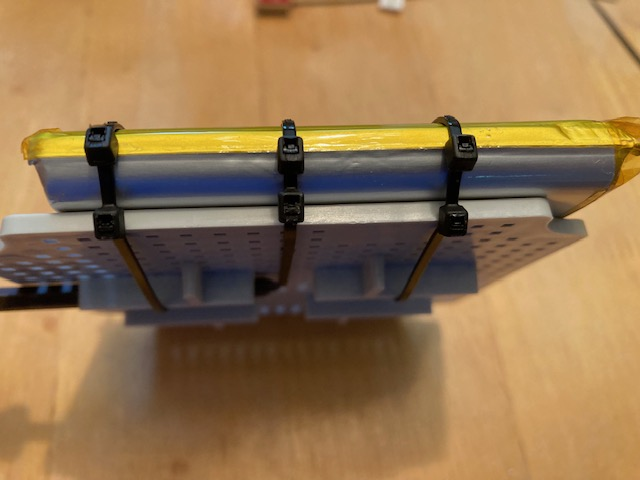

## Connections

The little IPEX connectors are somewhat fragile, so work carefully when connecting those.

Connect the antenna coax cable IPEX connection to the RAK radio.  Use a zip tie to secure the coax cable to the nearby hole in the RAK 13302 board.  This zip tie is important to hold the antenna connector in place so it is not easily dislodged.  

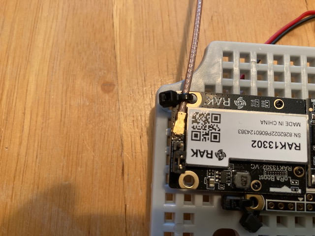

Plug the solar cable pigtail into the RAK radio.  **Make sure you have the connector and the red wire oriented correctly!**

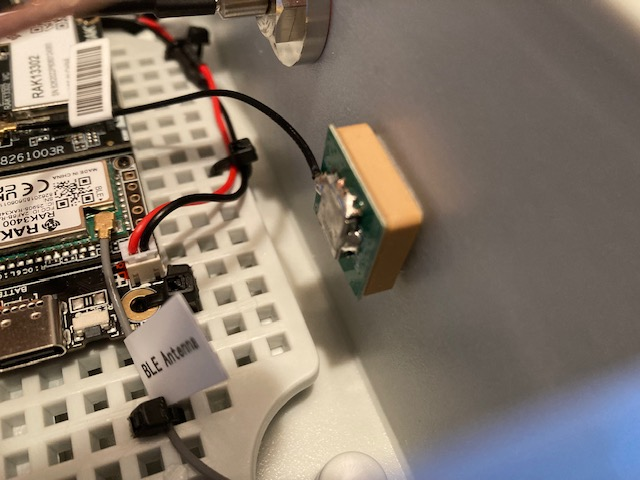

Bundle up the solar cable pigtail and use zip ties to secure it to the left side of the perfboard.  Leave a couple of inches free on the USB end to make it easier to plug in the solar panel USB-C cable later.

Connect the Bluetooth antenna to the RAK radio.

Connect the GPS antenna to the RAK radio.

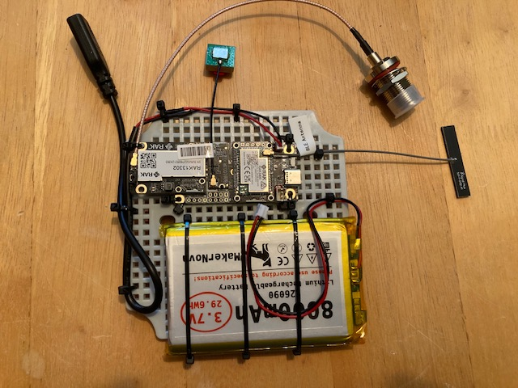

## Mount everything in the enclosure

Carefully lower the perfboard into the enclosure and secure it with the two screws.

Insert the antenna bulkhead mount through the top hole in the enclosure and secure it with the nut and lock washer.  Use one wrench to hold the bullkhead connector in place and a second wrench to tighten the nut.  You want it tight enough that it will not rotate in the hole when you attach an external antenna or coax cable.

Insert the cable gland in the bottom hole.  You want it fairly tight, but be careful not to overtighten and strip the plastic threads.

Peel the backing from the sticky tape on the GPS antenna, and stick it to the underside of the top of the inside of the enclosure.

Peel the backing from the sticky tape on the Bluetooth antenna, and stick it on the bottom of the inside of the enclosure.

**Leave the battery disconnected for now.  You will damage the radio if you power it on without an antenna attached.**

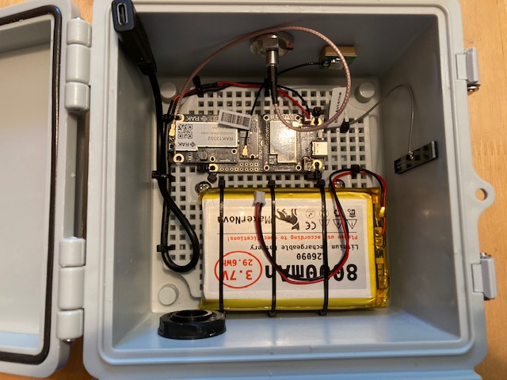
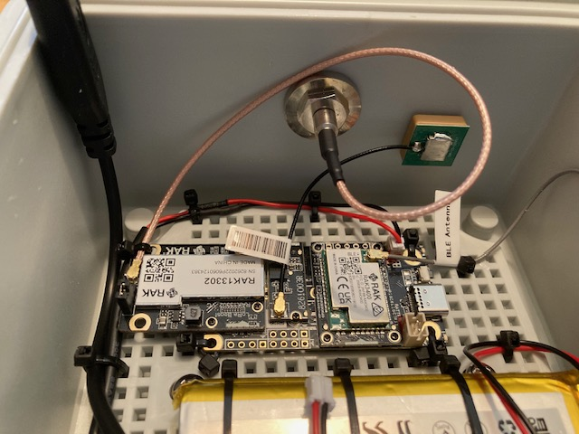
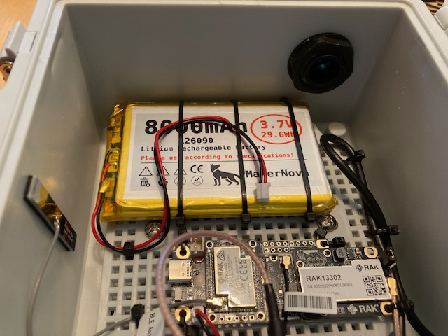
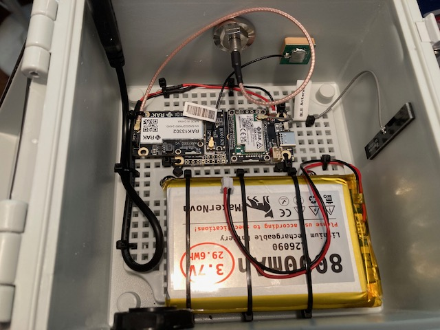

## Antenna

At this point you need an antenna connected before you can configure the radio.  

If you have one of the small ALFA 915 antennas, you can screw it onto the antenna connector on the top of the enclosure.

If you have the larger antennas, laying it out alongside the enclosure on a wooden or plastic table might make it easier due to the size.  There is a chance that a metal table might severely affect the SWR of the antenna if the antenna is paying on it, so you might want to avoid using a metal table.

Connect the external antenna and external coax cable and double check it is connected properly.

## Configuration

With the antenna properly connected, we can now install the firmware.

Connect a USB-C cable from the USB-C port on the RAK radio to your computer.  A [90 degree USB-C adapter](https://www.amazon.com/dp/B0C2WKDYT6?th=1) can make it easier to connect the USB cable to the RAK.

**Note the battery should be left disconnected at this time.**

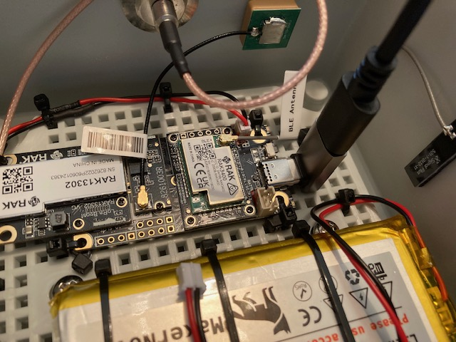

For the RAK Wireless 1 watt radio, you will need to:
1) Erase the flash
2) Install the OTAFIX bootloader
3) Erase the flash again
4) Install the Meshcore firmware

To do this:

Use the Meshcore Web Flasher located at [https://meshcore.io/flasher](https://meshcore.io/flasher)

Select "RAK WisMesh 1W Booster (3401 + 13302)".

Select "Repeater".

1) Erase the flash the first time.

Click the physical reset button (next to the USB connector) on the RAK radio twice rapidly to put it in DFU mode.  A pop up window should appear on your computer showing the files on the RAK radio.

Once in DFU mode, click "Erase Flash".  

When the pop up window says "You can flash Meshcore now", click OK.

You need to DISCONNECT the USB cable from your computer and ensure the RAK radio powers down.

2) Install the OTAFIX bootloader.  

Click on the link "OTAFIX bootloader" near the top of the page and download the bootloader firmware.  It will be called something like "wiscore_rak4631_board_bootloader-0.9.2-OTAFIX2.2.uf2".

Wait 10 seconds, then reconnect the USB cable to your computer to power the RAK radio back on.

Put the radio into DFU mode again by pressing the reset button twice rapidly.  A pop up window should come up showing the files on the radio.  

Copy and paste the OTAFIX bootloader file into this window.

The radio will reboot.

Wait 20 seconds, then DISCONNECT the USB cable from your computer and ensure the RAK radio powers down.

3) Erase the flash the second time.

Wait 10 seconds, then reconnect the USB cable to your computer to power the RAK radio back on.

Put the radio into DFU mode again by pressing the reset button twice rapidly.  A pop up window should come up showing the files on the radio.

Once in DFU mode, click "Erase Flash".  

When the pop up window says "You can flash Meshcore now", click OK.

You need to DISCONNECT the USB cable from your computer and ensure the RAK radio powers down.

4) Install the Meshcore firmware.

Wait 10 seconds, then reconnect the USB cable to your computer to power the RAK radio back on.

Put the radio into DFU mode again.  A pop up window should come up showing the files on the radio.  

Click the "Flash!" button to install the Meshcore firmware on the radio.

When the firmware has finished installing, and the radio has rebooted, click on the "Configure via USB" button and configure the radio using the recommendations on the [Repeater page](README.md).

Once done, disconnect the USB-C cable from the RAK radio and your computer, and ensure there is no power going to the RAK radio (Making sure the USB, Battery, and solar are NOT connected).

##  Mount it

If you are going to mount the repeater on a pole, attach the pole mounting kit to the back of the enclosure.

Use the screws included with the enclosure, not the mounting kit.

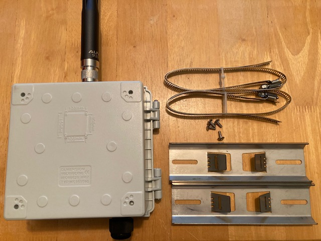
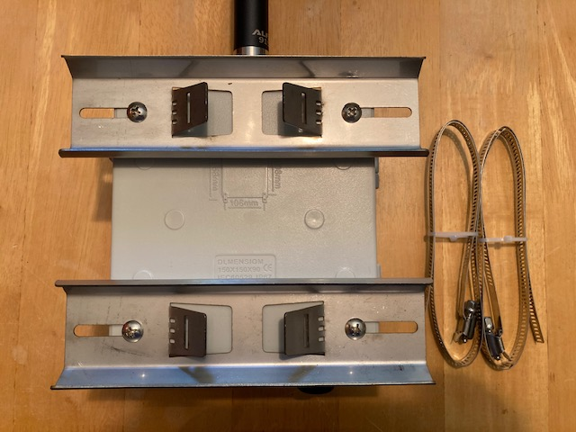

If you are going to mount the solar panel on a pole, remove the blue plastic protective film from the Universal Mounting bracket, and mount it to the solar panel using three 1 inch long 1/4 inch bolts, three nuts, and six washers.  Place washers both under the head of the bolts and under the nut.  If the holes in the solar panel bracket are a little tight, you can relieve them a little bit with a small round file, or drill them out with a 1/4 drill bit.

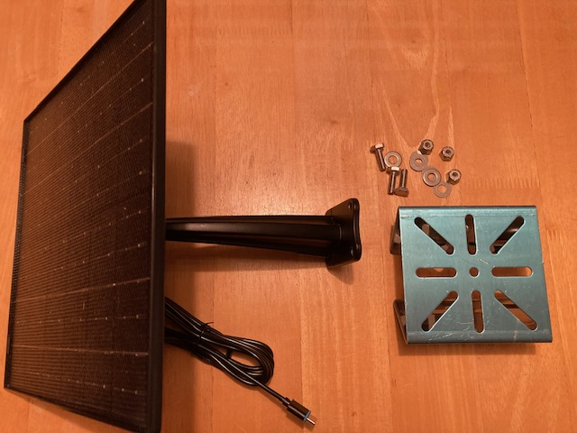
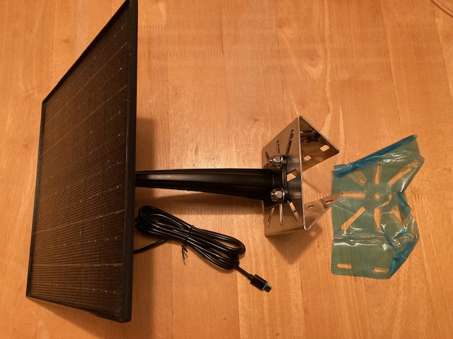
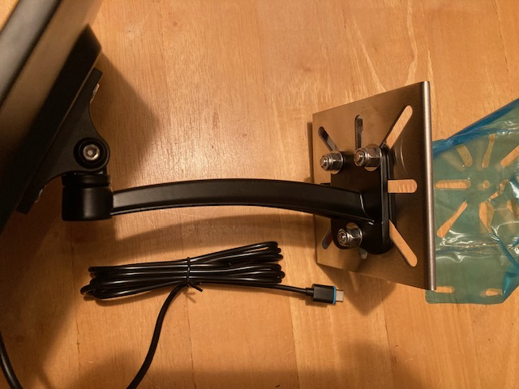

Using hose clamps, mount the solar panel and the enclosure to the pole.

If you are using one of the larger antennas, mount the antenna to the top of the pole, and connect the coax cable to the antenna and the bulkhead connector on the top of the enclosure.

## Power it up

Ensure that the jumper for power selection is in the "Internal" position.  This would be towards the left as seen in this picture:

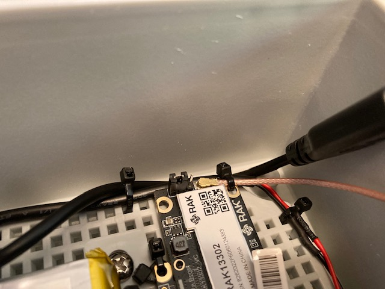

After double checking that the antenna is connected properly, you are now ready to power on the RAK radio.

Inside the enclosure, connect the battery to the RAK radio.  **Make sure you have the connector and the red wire oriented correctly!  Note the red wire is on the OPPOSITE side as the red wire for the solar connector.**

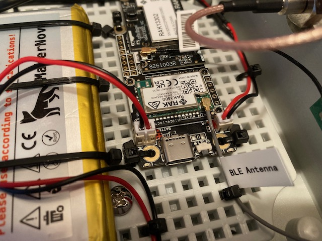

The cable gland is large enough to pass the solar panel USB-C plug through, but that leaves a gap for the solar panel cable itself.  We need to seal this up to keep bugs from building nests here.

You may be able to find a rubber grommet that is the correct size.  I chose to use [black RTV (gasket maker)](https://www.amazon.com/dp/B0002UEN1U?th=1).

Unscrew the outside section of the cable gland, and remove the rubber gasket.

Slide the solar panel USB cable through the rubber gasket by about 3 inches.

Fill the gap between the solar panel USB cable and the rubber gasket with black RTV.

Allow this to cure overnight BEFORE attempting the next step.

In order to make the gasket removable, cut a slit in the gasket lengthwise (along the length of the cable).  This allows you to remove the rubber gasket from the solar panel USB cable.  The flush cutters work well to make a clean cut without damaging the cable.

Remove the gasket from the cable.

Slide the solar panel USB cable in through the outer part of the cable gland (the screw cap).

Put the gasket on the cable, between the USB end and the outer part of the cable gland.

Slide the USB end of the cable through the cable gland itself into the enclosure and connect it to the USB-C pigtail.

Slide the gasket up the cable, and insert the gasket into the cable gland.

Screw the bottom part of the cable gland on and tighten it.  It should form a complete seal with no gaps or holes.

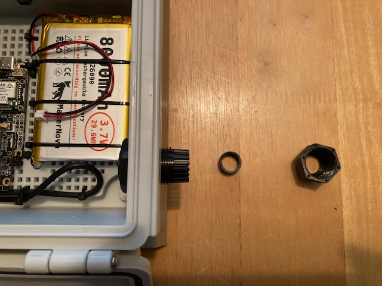
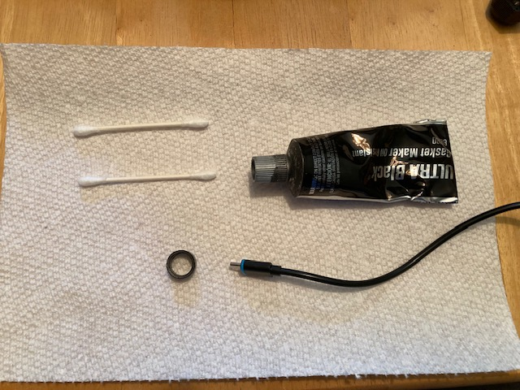
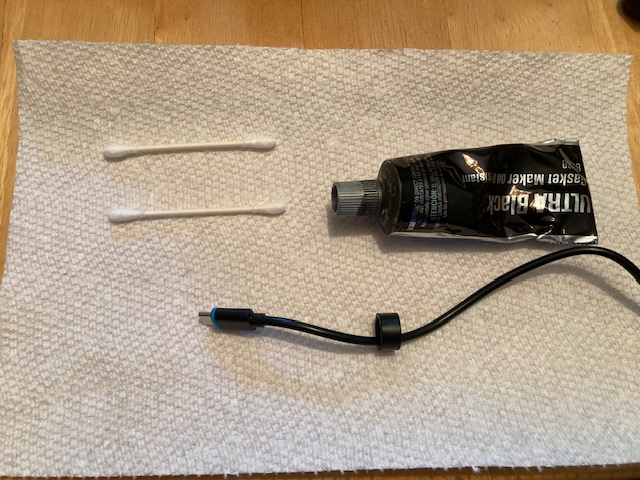
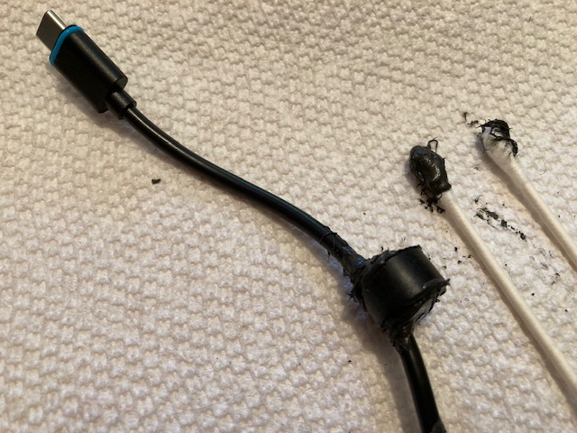
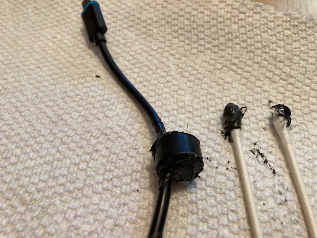

